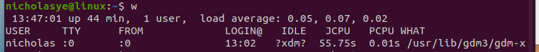
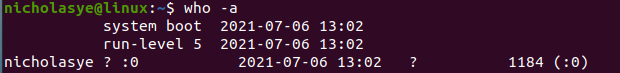
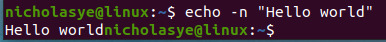
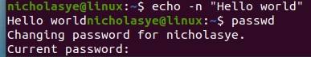

# 一、基础篇
## 1 linux系统使用基础
### 1.1 常用linux命令
#### 1.1.1 linux命令的基本格式
1. /root是超级用户的目录，/home是普通用户的目录
2. cd 用于切换目录 `cd /nicholas/local`
3. ls 用于显示目录下的所有文件，`ls -l`可以显示详细信息，`ls--all`可以显示包括隐藏文件的所有文件
#### 1.1.2 linux的简单命令
1. w命令：可以显示所有用户的信息 `w [选项] [用户名]`
   1. w -h 不显示输出信息标题
   2. w -l 用详细格式输出
   3. w -s 用简洁格式输出

2. who命令：只能显示当前登录的用户信息  `who [选项] [file]`
   1. who -a 全部显示 
3. echo命令 `echo [选项] [输出内容]`
   1. echo "Hello World" 
   2. echo "Hello World" 
   3. **不知道为啥，在我眼中，科技最大的浪漫就是电脑回复你Hello World的那一刻**
4. date命令 `date [选项]`
   1. date 
   2. data -s 设置时间
5. passwd命令 `passwd [选项] 用户名`
   1. root用户可通过 passwd xxx 修改普通用户的密码
   2. passwd 可以直接修改自己的密码 

### 1.2 软件包